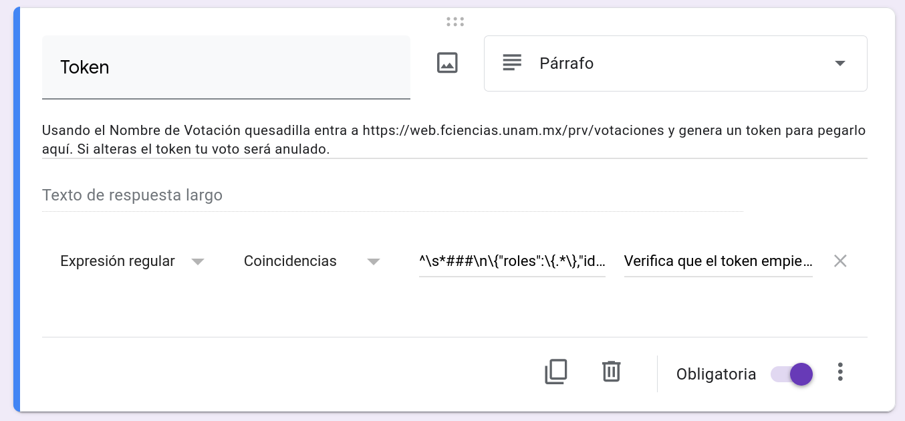
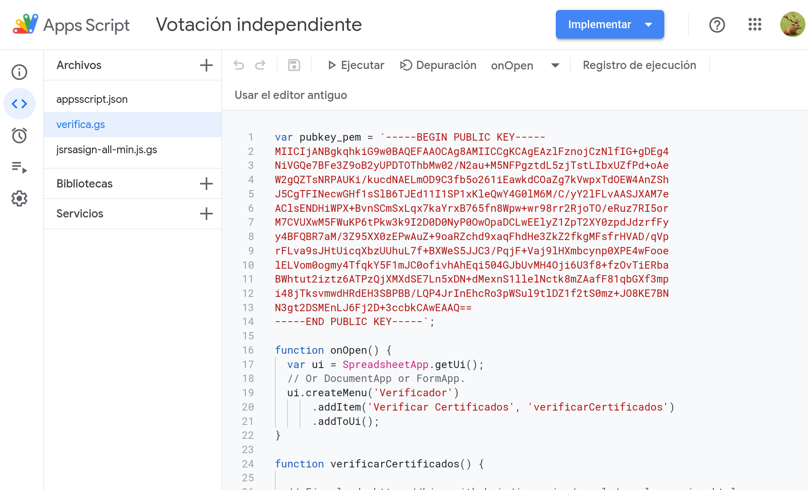
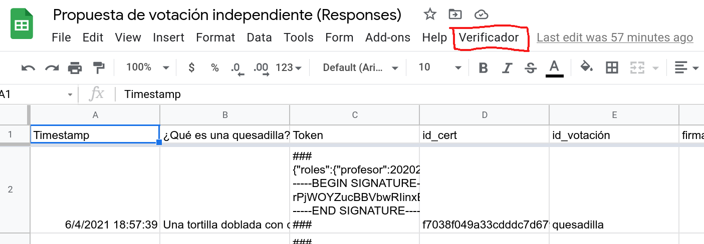

# ¿Cómo organizar una votación usando google forms?
Para utilizar este sistema usando google forms sólo es necesario agregar una pregunta al final del formulario para que los votantes puedan incluir su token. Además, es muy importante agregar una validación en esa pregunta para poder detectar oportunamente errores de copiado/pegado que pudieran anular votos innecesariamente. Para lograr esto debes seguir los siguientes pasos:
* Agregar **al final** del formulario una pregunta de tipo 'Párrafo'.
* Esta pregunta debe estar marcada como obligatoria.
* En la configuración de la pregunta elegir la opción de 'Validación de respuesta'. En el tipo de validación elegir 'Expresión regular' y 'Coincidencias' (Matches)
* En la sección de patrón colocar el más indicado para tu votación. Esta validación servirá para hacer un prefiltrado de los certificados aceptados (debes reemplazar el TU_ID_VOTACIÓN por el que elegiste previamente):
  * Todos pueden votar:
    * `^\s*###\n\{"roles":\{.*\},"id_votación":"TU_ID_VOTACIÓN".*\}\n-----BEGIN SIGNATURE-----\n\S{684}\n-----END SIGNATURE-----\n###\s*$`
  * Sólo estudiantes votan:
    * `^\s*###\n\{"roles":\{.*estudiante.*\},"id_votación":"TU_ID_VOTACIÓN".*\}\n-----BEGIN SIGNATURE-----\n\S{684}\n-----END SIGNATURE-----\n###\s*$`
  * Sólo profesores o ayudantes votan:
    * `^\s*###\n\{"roles":\{.*(profesor|ayudante).*\},"id_votación":"TU_ID_VOTACIÓN".*\}\n-----BEGIN SIGNATURE-----\n\S{684}\n-----END SIGNATURE-----\n###\s*$`
  * Todos los activos en 2020-2,2021-1,2021-2 votan:
    * `^\s*###\n\{"roles":\{.*(20202|20211|20212).*\},"id_votación":"TU_ID_VOTACIÓN".*\}\n-----BEGIN SIGNATURE-----\n\S{684}\n-----END SIGNATURE-----\n###\s*$`
  * Estudiantes activos en 2020-2,2021-1,2021-2 votan:
    * `^\s*###\n\{"roles":\{.*"estudiante":(20202|20211|20212).*\},"id_votación":"TU_ID_VOTACIÓN".*\}\n-----BEGIN SIGNATURE-----\n\S{684}\n-----END SIGNATURE-----\n###\s*$`
* Procura poner un mensaje de error personalizado descriptivo. Por ejemplo: *Verifica que el token empieza y termina con "###" y que el Nombre de la Votación es "TU_ID_VOTACIÓN". Si alteras tu token de cualquier forma tu voto será anulado*.
* El resultado de esto se ve así:


IMPORTANTE: La pregunta del certificado **debe ser la última** en el formulario para que aparezca en la última columna y el script de análisis funcione.

# ¿Cómo validar los tokens presentados en la votación?

Para validar los resultados, hay que generar un Google Sheet asociado a los resultados de Google Forms. Dentro del Sheet de resultados hay que entrar a Tools->ScriptEditor y agregar los archivos
```
verifica.gs
jsrsasign-all-min.js.gs (agregué dos líneas al inicio para poderlo usar en appsscript)
appsscript.json Para mostrarlo ir a settings y poner "Show appsscript.json" manifest in file editor
```
  
  
El editor debe quedar como en esta captura de pantalla:

  
  
  

El script en `verifica.gs` agrega un menú `Verificador` al sheets para poder validar los resultados.

  
  
  
También hay un `key_test.gs` que sirve para probar que la verificación funcione pero éste no se necesita para usar este sistema.

El archivo `jsrsasign-all-min.js` es una biblioteca de funciones criptográficas (Para más información véase [jsrasign](https://github.com/kjur/jsrsasign)).
